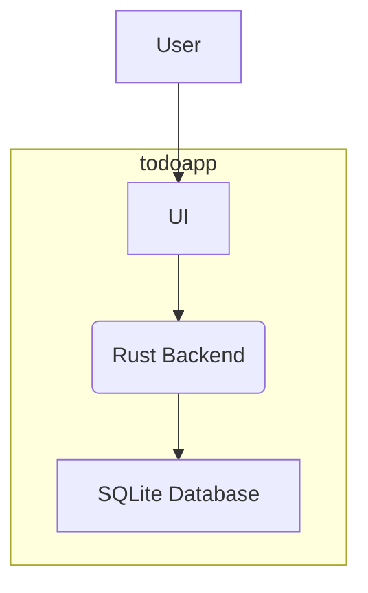

# Project Architecture

Pattern: monolith

## Design Principles

### Principle 1
Description:
- simplicity over conciseness
Reasoning:
- intermediate developers should feel at home in this codebase

### Principle 2
Description:
- layered testing
Reasoning:
- by combining layers of unit tests, integration tests, and end-to-end tests, maximal test coverage can be achieved

## High-level Architecture:

## Major Components

### Component 1:
Name: backend
Purpose: store data in SQLite, provide REST API for UI
Description and Scope:
- description: simple single-binary Rust application which exposes an API on port 8080 and writes an SQLite database to the local filesystem in $HOME/.todoapp/db.sqlite
- scope: handles all data manipulation and state. does not render any UI components directly.

### Component 2:
Name: UI
Purpose: display a web-based user interface to the user. loads and interacts with all data via the REST API exposed by the backend component.
Description and Scope:
- description: a simple, responsive webapp.
- scope: UI components rendered by React, no locally stored state; all data stored in backend service and accessed/manipulated via REST API.

## Security
Transport: none
Authentication: none
RBAC:
- no RBAC, user can access all data